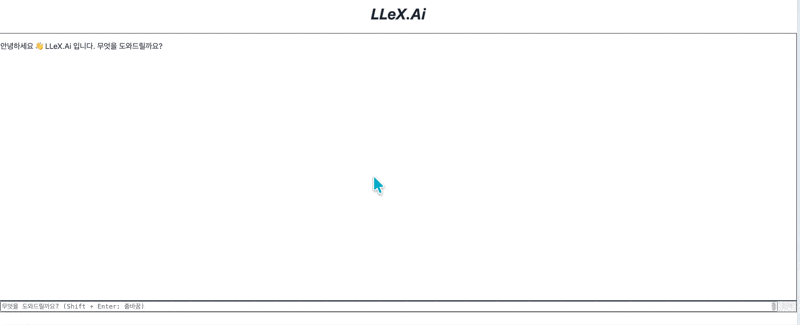

# 🏢 LLeX.Ai - 산업안전보건 법령 AI 챗봇

[](https://www.python.org/downloads/)
[](https://fastapi.tiangolo.com/)
[](https://reactjs.org/)
[](https://www.docker.com/)
[](LICENSE)

> **산업안전보건 관련 9개 법령 (2,312개 조문)을 검색하고 해석하는 AI 기반 법률 챗봇**

<div align="center">
  
</div>


---

## 📋 목차

- [✨ 주요 기능](#-주요-기능)
- [🛠️ 기술 스택](#️-기술-스택)
- [🚀 빠른 시작 (Quick Start)](#-빠른-시작-quick-start)
- [📂 프로젝트 구조](#-프로젝트-구조)
- [🔧 상세 설정](#-상세-설정)
- [📊 데이터 현황](#-데이터-현황)
- [🏗️ 아키텍처](#️-아키텍처)
- [🧪 테스트](#-테스트)
- [🐛 트러블슈팅](#-트러블슈팅)
- [📝 API 문서](#-api-문서)
- [👥 기여 가이드](#-기여-가이드)
- [📄 라이선스](#-라이선스)

---

## ✨ 주요 기능

### 🎯 핵심 기능
- **🔍 정확한 조문 검색**: PostgreSQL 기반 즉시 검색 (예: "산업안전보건법 1조")
- **🧠 의미 기반 검색**: Qdrant 벡터 DB 활용 유사도 검색 (10,356개 임베딩)
- **🤖 멀티 에이전트 시스템**: LangGraph 기반 Question Router + 6개 Tool Agent
- **⚡ 실시간 스트리밍**: SSE(Server-Sent Events) 기반 점진적 응답
- **🔄 자동 Fallback**: 법령 미발견 시 웹 검색 자동 연결

### 🎨 UX/UI 특징
- **실시간 타이핑 효과**: 자연스러운 답변 생성 경험
- **상태 메시지 표시**: Tool 실행, DB 저장 등 진행 상황 실시간 표시
- **법령 출처 링크**: 법제처 공식 사이트 직접 연결

---

## 🛠️ 기술 스택

### Backend
```
FastAPI 0.115.5    │ Python 3.11+
OpenAI GPT-4o-mini │ LangChain 0.3.27
LangGraph 0.2.60   │ Qdrant 1.11.1
PostgreSQL 15      │ SQLAlchemy 2.0.36
```

### Frontend
```
React 19.1.1       │ TypeScript 5.9.3
Vite 7.1.7         │ TailwindCSS 4.1.14
React Markdown     │ Remark-GFM
```

### Infrastructure
```
Docker Compose 3.8 │ Nginx (Alpine)
Prometheus Client  │ MLflow 2.18.0
```

---

## 🚀 빠른 시작 (Quick Start)

### 📋 사전 요구사항

- **Docker**: 20.10 이상
- **Docker Compose**: 2.0 이상
- **Git**: 최신 버전

### 1️⃣ 프로젝트 클론

```bash
git clone https://github.com/codingiswine/llex.git
cd llex
```

### 2️⃣ 환경 변수 설정

```bash
cd llex_backend
cp .env.example .env
nano .env  # 또는 vim, code 등
```

**필수 입력 항목**:
```bash
# 🔑 OpenAI API Key (필수)
OPENAI_API_KEY=sk-proj-your-api-key-here

# 🗄️ PostgreSQL Password (필수)
DB_PASS=your-secure-password

# 🌐 기타 API (선택사항)
GOOGLE_SEARCH_API_KEY=your-google-api-key
NAVER_CLIENT_ID=your-naver-client-id
NAVER_CLIENT_SECRET=your-naver-client-secret
```

> **💡 OpenAI API 키 발급**: https://platform.openai.com/api-keys

### 3️⃣ Docker 빌드 및 실행

```bash
# 프로젝트 루트 디렉토리에서
docker compose build --no-cache
docker compose up -d
```

**예상 빌드 시간**:
- 최초 빌드: ~5분 (인터넷 속도에 따라 다름)
- 재빌드: ~2분

### 4️⃣ 서비스 확인

#### 웹 인터페이스
```bash
# 프론트엔드
open http://localhost:3000

# API 문서 (Swagger UI)
open http://localhost:8000/docs

# Health Check
curl http://localhost:8000/health
```

**예상 응답**:
```json
{
  "status": "ok",
  "version": "0.8.2"
}
```

### 5️⃣ 테스트 쿼리

#### 웹 인터페이스에서
1. http://localhost:3000 접속
2. 검색창에 입력: **"산업안전보건법 1조"**
3. Enter 또는 전송 버튼 클릭

#### cURL로 직접 테스트
```bash
curl -X POST http://localhost:8000/api/ask \
  -H "Content-Type: application/json" \
  -d '{
    "user_id": "test_user",
    "question": "산업안전보건법 1조"
  }'
```

---

## 📂 프로젝트 구조

```
llex/
├── 📁 llex_backend/               # FastAPI 백엔드
│   ├── 📁 app/
│   │   ├── 📁 api/                # API 라우트
│   │   │   ├── routes.py          # 메인 엔드포인트 (/api/ask)
│   │   │   └── models.py          # Pydantic 모델
│   │   ├── 📁 services/           # 비즈니스 로직
│   │   │   ├── question_router.py # 질의 분류기
│   │   │   ├── gpt_service.py     # OpenAI API 호출
│   │   │   └── qdrant_service.py  # 벡터 검색
│   │   ├── 📁 tools/              # LangChain Tools
│   │   │   ├── law_rag_tool.py    # 법령 검색 Tool
│   │   │   ├── websearch_tool.py  # 웹 검색 Fallback
│   │   │   └── ...
│   │   ├── config.py              # 설정 관리
│   │   └── main.py                # FastAPI 앱 진입점
│   ├── 📁 core/                   # 공통 모듈
│   │   ├── logger.py              # 로깅 유틸
│   │   └── stream.py              # SSE 스트리밍
│   ├── Dockerfile                 # 백엔드 Docker 이미지
│   ├── requirements.txt           # Python 의존성
│   ├── .env.example               # 환경 변수 템플릿
│   └── init.sql                   # PostgreSQL 초기화 스크립트
│
├── 📁 llex_frontend/              # React 프론트엔드
│   ├── 📁 src/
│   │   ├── 📁 components/         # React 컴포넌트
│   │   │   ├── ChatWindow.tsx     # 채팅 인터페이스
│   │   │   ├── SearchBar.tsx      # 검색 입력창
│   │   │   └── ...
│   │   ├── 📁 services/
│   │   │   └── api.ts             # API 클라이언트
│   │   ├── 📁 types/              # TypeScript 타입
│   │   ├── App.tsx                # 메인 앱
│   │   └── main.tsx               # 진입점
│   ├── Dockerfile                 # 프론트엔드 Docker 이미지
│   ├── package.json               # Node.js 의존성
│   ├── vite.config.ts             # Vite 설정
│   └── tsconfig.json              # TypeScript 설정
│
├── 📁 pgdata/                     # PostgreSQL 데이터 (Git 무시)
├── 📁 qdrant_storage/             # Qdrant 데이터 (Git 무시)
├── docker-compose.yml             # Docker Compose 설정
├── .gitignore                     # Git 무시 파일
└── README.md                      # 이 파일
```

---

## 🔧 상세 설정

### 환경 변수 상세 설명

#### 필수 환경 변수

| 변수명 | 설명 | 예시 |
|--------|------|------|
| `OPENAI_API_KEY` | OpenAI API 키 | `sk-proj-...` |
| `DB_PASS` | PostgreSQL 비밀번호 | `securepass123` |

#### 선택 환경 변수

| 변수명 | 설명 | 기본값 |
|--------|------|--------|
| `DB_NAME` | 데이터베이스 이름 | `llex` |
| `DB_USER` | 데이터베이스 사용자 | `daniel` |
| `DB_HOST` | 데이터베이스 호스트 | `postgres` |
| `QDRANT_HOST` | Qdrant 호스트 | `qdrant` |
| `QDRANT_PORT` | Qdrant 포트 | `6333` |
| `GOOGLE_SEARCH_API_KEY` | Google 검색 API 키 | - |
| `NAVER_CLIENT_ID` | Naver 검색 클라이언트 ID | - |
| `NAVER_CLIENT_SECRET` | Naver 검색 시크릿 | - |

### 포트 변경

기본 포트를 변경하려면 `docker-compose.yml` 수정:

```yaml
services:
  frontend:
    ports:
      - "3000:80"  # 좌측 숫자를 변경 (예: "8080:80")

  fastapi:
    ports:
      - "8000:8000"  # 좌측 숫자를 변경 (예: "9000:8000")
```

---

## 📊 데이터 현황

### 수록 법령 (9개)

| 법령명 | 조문 수 | 시행일 |
|--------|---------|--------|
| 산업안전보건기준에관한규칙 | 877 | 2024-01-01 |
| 산업안전보건법시행규칙 | 486 | 2024-01-01 |
| 산업안전보건법 | 350 | 2024-01-01 |
| 산업안전보건법시행령 | 238 | 2024-01-01 |
| 재난및안전관리기본법 | 164 | 2024-01-01 |
| 재난및안전관리기본법시행령 | 102 | 2024-01-01 |
| 재난및안전관리기본법시행규칙 | 50 | 2024-01-01 |
| 중대재해처벌등에관한법률 | 32 | 2024-01-27 |
| 중대재해처벌등에관한법률시행령 | 13 | 2024-01-27 |

**총계**: 2,312개 조문

### 벡터 임베딩

- **총 임베딩 수**: 10,356개
- **임베딩 모델**: OpenAI `text-embedding-3-large`
- **차원**: 3,072
- **벡터 DB**: Qdrant (Cosine Similarity)

---

## 🏗️ 아키텍처

### 시스템 구성도

```
┌─────────────┐
│   사용자    │
└──────┬──────┘
       │ HTTP
       ↓
┌─────────────────────────────────────┐
│  Frontend (React + Vite)            │
│  - http://localhost:3000            │
│  - Nginx (Alpine)                   │
└──────┬──────────────────────────────┘
       │ POST /api/ask
       ↓
┌─────────────────────────────────────┐
│  Backend (FastAPI)                  │
│  - http://localhost:8000            │
│                                     │
│  ┌─────────────────────────────┐  │
│  │  Question Router            │  │
│  │  (질의 분류 및 도구 선택)    │  │
│  └───────────┬─────────────────┘  │
│              ↓                     │
│  ┌─────────────────────────────┐  │
│  │  Law RAG Tool               │  │
│  │  ├─ PostgreSQL 조문 검색    │  │
│  │  ├─ Qdrant 벡터 검색        │  │
│  │  └─ GPT-4o-mini 요약        │  │
│  └───────────┬─────────────────┘  │
│              ↓                     │
│  ┌─────────────────────────────┐  │
│  │  Web Search Fallback        │  │
│  │  (법령 미발견 시)            │  │
│  └─────────────────────────────┘  │
└─────────────────────────────────────┘
       │
       ↓ SSE Stream
┌─────────────────────────────────────┐
│  사용자에게 실시간 응답              │
└─────────────────────────────────────┘
```

### 검색 파이프라인

```
1. 사용자 질의 입력
   ↓
2. Question Router
   - 질의 유형 분석 (법령 검색 / 일반 질문 / 뉴스 검색 등)
   - 적절한 Tool 선택
   ↓
3. Law RAG Tool 실행
   - [Phase 1] PostgreSQL 정확한 조문 검색
   - [Phase 2] Qdrant 벡터 유사도 검색 (Top-K)
   - [Phase 3] GPT-4o-mini 컨텍스트 기반 답변 생성
   ↓
4. Fallback (필요 시)
   - 법령 조문 없음 감지
   - Web Search Tool 자동 호출
   ↓
5. 스트리밍 응답
   - SSE로 점진적 전송
   - 실시간 타이핑 효과
   ↓
6. DB 저장
   - PostgreSQL chat_history 테이블
   - 품질 점수 자동 계산
```

---

## 🧪 테스트

### 기능 테스트

#### 1. 정확한 조문 검색
```bash
질문: "산업안전보건법 1조"
예상: 산업안전보건법 제1조(목적) 전문 표시
```

#### 2. 법령 해석 질문
```bash
질문: "추락 위험 작업 시 안전 조치는?"
예상: 관련 조문 검색 → 실무 중심 해석
```

#### 3. Web Fallback
```bash
질문: "최근 산업재해 통계"
예상: 법령 미발견 → Web 검색 → 종합 답변
```

### Docker 컨테이너 상태 확인

```bash
# 모든 컨테이너 상태
docker ps

# 예상 출력:
# CONTAINER ID   IMAGE              STATUS         PORTS
# ...            llex-frontend      Up 2 minutes   0.0.0.0:3000->80/tcp
# ...            llex_backend       Up 2 minutes   0.0.0.0:8000->8000/tcp
# ...            postgres:15        Up 2 minutes   0.0.0.0:5432->5432/tcp
# ...            qdrant/qdrant      Up 2 minutes   0.0.0.0:6333->6333/tcp

# 백엔드 로그 확인
docker logs llex_backend --tail 50

# 프론트엔드 로그 확인
docker logs llex_frontend --tail 20
```

### 헬스 체크

```bash
# 백엔드 헬스 체크
curl http://localhost:8000/health

# PostgreSQL 연결 테스트
docker exec -it postgres psql -U daniel -d llex -c "SELECT COUNT(*) FROM chat_history;"

# Qdrant 컬렉션 확인
curl http://localhost:6333/collections/laws
```

---

## 🐛 트러블슈팅

### 문제 1: "Failed to fetch" 에러

**증상**: 브라우저에서 검색 시 `Failed to fetch` 표시

**원인**: CORS 또는 백엔드 미실행

**해결**:
```bash
# 1. 백엔드 상태 확인
docker ps | grep llex_backend

# 2. 백엔드 재시작
docker compose restart fastapi

# 3. 브라우저 캐시 삭제
# Chrome: Cmd+Shift+Delete → "Cached images and files"
```

---

### 문제 2: PostgreSQL 연결 오류

**증상**: 백엔드 로그에 `connection refused` 또는 `password authentication failed`

**원인**: PostgreSQL 컨테이너 미실행 또는 비밀번호 불일치

**해결**:
```bash
# 1. PostgreSQL 컨테이너 확인
docker ps | grep postgres

# 2. .env 파일 확인
cat llex_backend/.env | grep DB_PASS

# 3. PostgreSQL 재시작
docker compose down
docker compose up -d postgres
sleep 10
docker compose up -d
```

---

### 문제 3: Qdrant 데이터 없음

**증상**: 벡터 검색 결과 없음

**원인**: Qdrant 컬렉션 미생성

**해결**:
```bash
# 데이터 로드 (백엔드 컨테이너 내부에서)
docker exec -it llex_backend python3 /app/app/tools/law_updater_async.py --all
```

---

### 문제 4: 프론트엔드 빌드 실패

**증상**: `npm ci` 또는 `npm run build` 실패

**원인**: Node.js 버전 불일치 또는 의존성 오류

**해결**:
```bash
# 1. 캐시 삭제 후 재빌드
docker compose down
docker rmi llex-frontend
docker compose build --no-cache frontend
docker compose up -d

# 2. 로컬에서 테스트 (선택사항)
cd llex_frontend
npm install
npm run build
```

---

### 문제 5: 포트 충돌

**증상**: `port is already allocated` 에러

**원인**: 3000, 8000, 5432, 6333 포트가 이미 사용 중

**해결**:
```bash
# 1. 사용 중인 포트 확인 (macOS/Linux)
lsof -i :3000
lsof -i :8000

# 2. 프로세스 종료 또는 포트 변경
# docker-compose.yml에서 ports 섹션 수정
```

---

## 📝 API 문서

### Swagger UI

http://localhost:8000/docs

### 주요 엔드포인트

#### POST `/api/ask`

**설명**: 질문에 대한 AI 답변 (스트리밍)

**요청**:
```json
{
  "user_id": "test_user",
  "question": "산업안전보건법 1조"
}
```

**응답** (SSE):
```
data: {"event": "text", "payload": "산업안전보건법 제1조..."}
data: {"event": "status", "payload": "✅ 법령 검색 완료"}
data: {"event": "status", "payload": "✅ 대화 저장 완료"}
```

---

#### GET `/api/history`

**설명**: 대화 기록 조회

**파라미터**:
- `user_id` (optional): 사용자 ID (기본: "linkcampus")
- `limit` (optional): 조회 개수 (기본: 50)

**응답**:
```json
{
  "total": 10,
  "history": [
    {
      "id": 1,
      "role": "user",
      "content": "산업안전보건법 1조",
      "tool": "law",
      "score": 95,
      "created_at": "2024-11-13T12:00:00"
    }
  ]
}
```

---

#### GET `/api/health`

**설명**: 헬스 체크

**응답**:
```json
{
  "status": "ok",
  "version": "0.8.2"
}
```

---

## 👥 기여 가이드

### 개발 환경 설정

```bash
# 1. 프로젝트 포크 및 클론
git clone https://github.com/codingiswine/llex.git
cd llex

# 2. 백엔드 개발 환경
cd llex_backend
python -m venv venv
source venv/bin/activate  # Windows: venv\Scripts\activate
pip install -r requirements.txt

# 3. 프론트엔드 개발 환경
cd llex_frontend
npm install
npm run dev  # http://localhost:5173
```

### 코드 스타일

- **Python**: PEP 8
- **TypeScript**: ESLint + Prettier

### Pull Request

1. 기능 브랜치 생성: `git checkout -b feature/new-feature`
2. 변경사항 커밋: `git commit -m "Add new feature"`
3. 브랜치 푸시: `git push origin feature/new-feature`
4. Pull Request 생성

---

## 📄 라이선스

MIT License

Copyright (c) 2024 Daniel Shin

Permission is hereby granted, free of charge, to any person obtaining a copy
of this software and associated documentation files (the "Software"), to deal
in the Software without restriction, including without limitation the rights
to use, copy, modify, merge, publish, distribute, sublicense, and/or sell
copies of the Software, and to permit persons to whom the Software is
furnished to do so, subject to the following conditions:

The above copyright notice and this permission notice shall be included in all
copies or substantial portions of the Software.

THE SOFTWARE IS PROVIDED "AS IS", WITHOUT WARRANTY OF ANY KIND, EXPRESS OR
IMPLIED, INCLUDING BUT NOT LIMITED TO THE WARRANTIES OF MERCHANTABILITY,
FITNESS FOR A PARTICULAR PURPOSE AND NONINFRINGEMENT. IN NO EVENT SHALL THE
AUTHORS OR COPYRIGHT HOLDERS BE LIABLE FOR ANY CLAIM, DAMAGES OR OTHER
LIABILITY, WHETHER IN AN ACTION OF CONTRACT, TORT OR OTHERWISE, ARISING FROM,
OUT OF OR IN CONNECTION WITH THE SOFTWARE OR THE USE OR OTHER DEALINGS IN THE
SOFTWARE.

---

## 📞 문의

- **개발자**: 신다니엘 (Daniel Shin)
- **Email**: codingiswine@gmail.com
- **GitHub**: [@codingiswine](https://github.com/codingiswine)

---

<div align="center">
  <p>⭐️ 이 프로젝트가 도움이 되셨다면 Star를 눌러주세요!</p>
  <p>Made with ❤️ by Daniel Shin</p>
</div>
